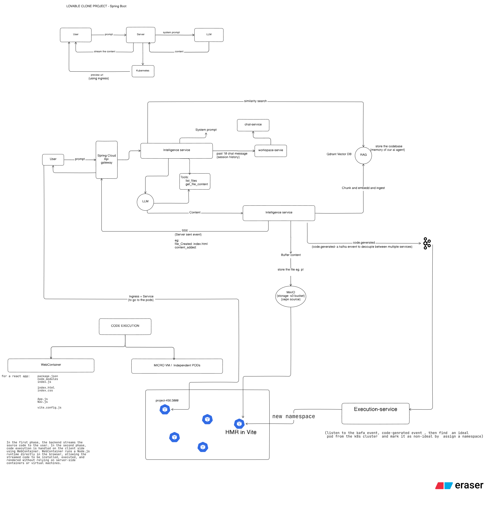
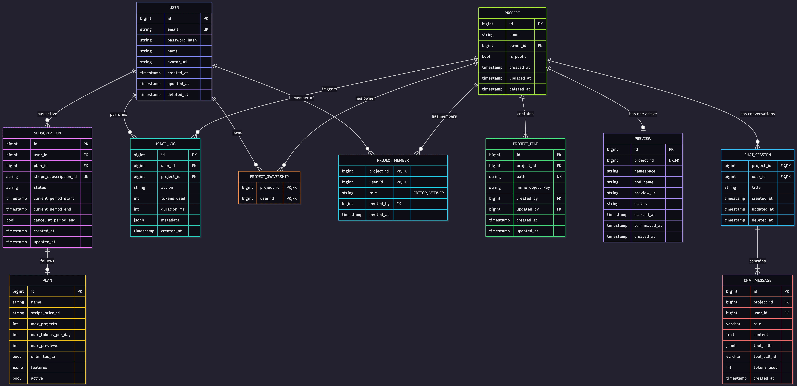

# Lovable Clone – AI App Builder Backend (Spring Boot)

A production-grade backend powering an **AI-driven full-stack application builder**, inspired by platforms like Lovable.

This system enables users to generate and manage complete web applications through AI-assisted workflows — supporting project isolation, role-based collaboration, and subscription-based feature access.

While Lovable focuses on rapid no-code generation, this project concentrates on building the **robust backend architecture required to support AI-generated applications in a production environment**.

The backend is designed to support:

* AI-assisted project scaffolding workflows
* Multi-tenant project isolation
* Strict role-based access control (OWNER / EDITOR / VIEWER)
* Stripe-powered subscription and feature gating
* Secure lifecycle and billing synchronization

Designed with strong emphasis on:

* Explicit ownership & authorization semantics
* Transactional correctness
* Idempotent webhook/event processing
* Security-first API design
* Stripe-driven subscription lifecycle management

---

#  Executive Summary (Recruiter Quick Scan)

* Engineered a production‑ready multi‑tenant backend with strict role‑based access control and ownership guarantees
* Designed a composite‑key membership model preventing duplicate memberships and privilege escalation
* Built a Stripe subscription engine with webhook‑driven lifecycle synchronization
* Implemented idempotent webhook handling to ensure concurrency‑safe state transitions
* Enforced Stripe as the single source of truth for billing state
* Implemented early trial termination with immediate billing conversion
* Ensured transactional integrity across all write operations

**Tech Stack:** Java 21, Spring Boot, Spring Data JPA, PostgreSQL (Neon), Stripe API (v31), JWT, MapStruct, Lombok

---
## System Architecture

### High-Level Architecture



Key components:

- AI Intelligence Service
- Chat Streaming (SSE)
- Workspace Service
- MinIO Object Storage
- Execution Service
- Kubernetes-based Preview Pods
- Stripe Billing Integration
- Usage & Quota Management

---

## AI Code Generation Engine

This backend includes a production-ready AI orchestration layer responsible for:

- Structured LLM prompt construction
- Streaming responses via SSE
- Tool-calling (file retrieval)
- Guardrail-enforced deterministic XML output
- MinIO-backed file persistence
- Circuit breaker protection

Full Detailed Documentation:

      AI Code Generation Engine → docs/AI_CODE_GENERATION_ENGINE.md


---

## 🗄️ Database Design

### ER Diagram



Highlights:

- Composite PK for project membership
- Strict ownership modeling
- Subscription lifecycle tracking
- Usage log auditing
- Preview isolation model
- Chat session & message tracking
---

#  Core Architecture Principles

## 1. Single Source of Truth

* Project ownership and membership exist exclusively in `project_members`
* No duplicated ownership columns on `projects`
* Subscription lifecycle is driven entirely by Stripe webhooks

All authorization and billing decisions are derived, never inferred.

---

## 2. Explicit Authorization Model

* Ownership modeled as a role (OWNER / EDITOR / VIEWER)
* Permissions decoupled from roles for extensibility
* Authorization enforced at the service layer
* Data access validated before exposure

The system intentionally differentiates **403 vs 404 semantics** to prevent resource enumeration attacks.

---

## 3. Separation of Concerns

Controller → Request mapping only
Service → Business logic + authorization
Repository → Data integrity + constraints

Stripe SDK is fully isolated inside `StripePaymentProcessor`, preserving clean domain boundaries.

---

#  Project & Collaboration System

## Ownership Model

```
ProjectRole = OWNER | EDITOR | VIEWER
```

* Exactly one OWNER per project
* OWNER exclusively manages lifecycle & membership
* Editors and viewers cannot escalate privileges

Composite primary key (`projectId`, `userId`) enforces one membership per user‑project pair at the database level.

---

## Permission Design

Permissions are capability‑based and decoupled from roles:

```
VIEW
EDIT
DELETE
MANAGE_MEMBERS
```

This prevents role explosion and allows flexible future policy extensions.

---

## Soft Delete Strategy

Projects are soft‑deleted via `deletedAt`:

* Preserves auditability
* Prevents irreversible destructive loss
* Filtering enforced at service/query layer

---

#  Subscription & Billing (Stripe Integration)

A production‑grade subscription engine designed with:

* Webhook‑driven lifecycle management
* Stripe‑side validation before checkout
* Idempotent activation semantics
* Plan‑based feature gating
* Early trial conversion support

Stripe acts strictly as infrastructure and lifecycle authority.

---

## Billing Architecture

```
Webhook Layer
    ↓
StripePaymentProcessor (Integration)
    ↓
SubscriptionService (Domain)
    ↓
JPA / PostgreSQL
```

This architecture isolates external provider logic from core domain services.

---

## Checkout Validation Strategy

Before creating checkout:

* Validate no ACTIVE / TRIALING / PAST_DUE Stripe subscription exists
* Query Stripe directly (not the database)
* Prevent duplicate active subscriptions

Stripe remains the authoritative subscription state machine.

---

## Trial Management

Supports:

* Automatic 7‑day trials
* Manual early trial termination via API
* Immediate billing conversion

Endpoint:

```
POST /api/subscription/end-trial
```

Flow:

* Stripe `trial_end = NOW`
* Invoice generated immediately
* Payment attempted
* Webhook updates DB → ACTIVE

Ensures billing correctness without direct database mutation.

---

## Subscription Lifecycle Coverage

Handled via Stripe webhooks:

* checkout.session.completed
* customer.subscription.updated
* customer.subscription.deleted
* invoice.paid
* invoice.payment_failed

Supported transitions:

* Trial → Active
* Early Trial Conversion
* Plan Upgrade / Downgrade
* Scheduled Cancellation
* Immediate Cancellation
* Payment Failure → PAST_DUE

---

## Idempotent Webhook Handling

Stripe may retry or reorder events.

Duplicate activation is prevented using:

```
existsByStripeSubscriptionId()
```

Ensures exactly‑once semantics under retry and concurrency conditions.

---

## Feature Gating Logic

Project creation limits enforced via subscription state:

* FREE → 1 project
* TRIAL → configurable limit
* ACTIVE → governed by `plan.maxProjects`
* Unlimited plans supported

Billing state remains cleanly separated from domain logic.

---

#  Security

* Webhook signature verification
* JWT‑based stateless authentication
* Explicit authorization checks
* No implicit data exposure

---

#  Concurrency & Consistency Guarantees

* All write operations transactional
* Unique constraint on `stripeSubscriptionId`
* Idempotent guards for webhook retries
* No partial state transitions

Designed to safely handle concurrent webhook deliveries and retry scenarios.


---
#  Tech Stack

* Java 21
* Spring Boot
* Spring Data JPA (Hibernate)
* PostgreSQL (Neon)
* Stripe API (v31)
* JWT Authentication
* MapStruct
* Lombok

---

#  Author

**Vikash Kumar Kharwar**
B.Tech CSE
Backend & Systems‑Focused Developer

---

## Detailed Documentation

- Backend Architecture → docs/CORE_BACKEND_ARCHITECTURE.md
- API Reference → docs/api-reference.pdf
- System Architecture → docs/system-architecture.png
- AI Code Generation Engine → docs/AI_CODE_GENERATION_ENGINE.md
---


## Note

This project is under active development and continues to evolve.

The current implementation focuses on production-oriented architectural principles, including strict authorization modeling, subscription lifecycle correctness, multi-tenant isolation, and AI orchestration safety in a SaaS-style backend system.